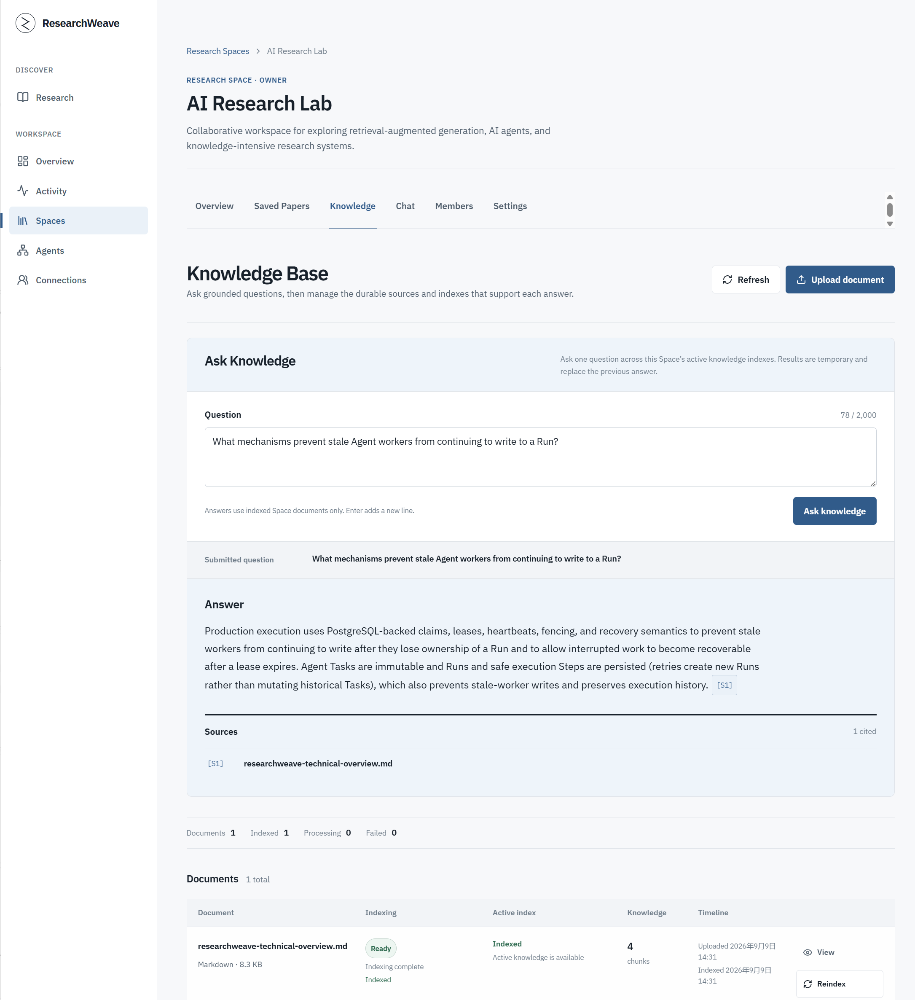
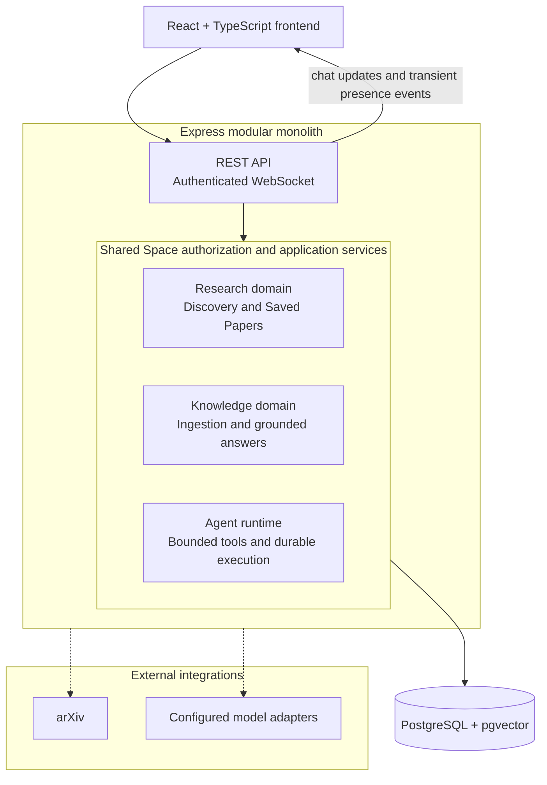
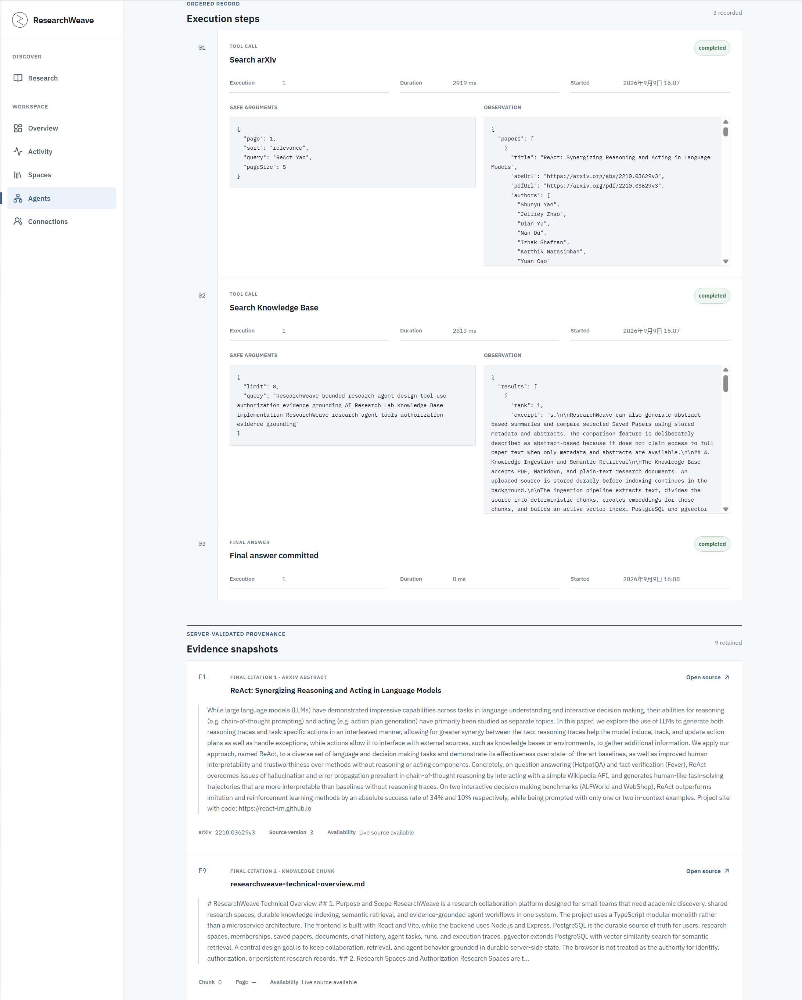
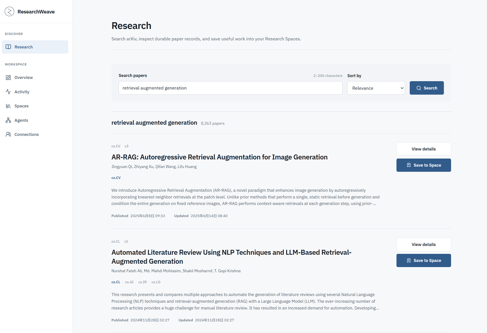
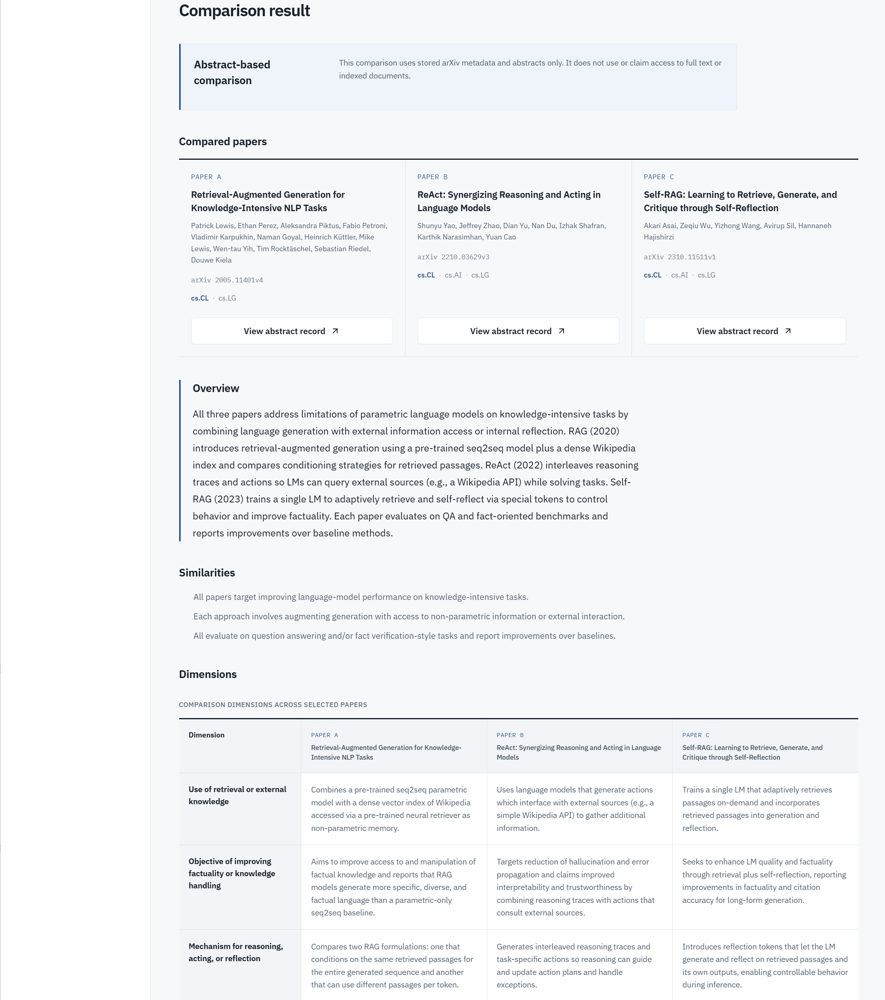

# ResearchWeave

**Academic discovery, Space-authorized RAG, and a bounded Agent runtime with inspectable evidence.**

ResearchWeave is a TypeScript research workspace for small teams. It connects live arXiv discovery with shared Research Spaces, durable Saved Papers, authenticated realtime collaboration, and Space-scoped knowledge workflows.

Within each Research Space, members can upload PDF, Markdown, and TXT documents. A background indexing pipeline extracts text, creates deterministic chunks and embeddings, and stores active indexes in PostgreSQL with pgvector. Retrieval is filtered by current Space authorization, and grounded answers cite only the retrieved source chunks supplied to the model.

ResearchWeave also includes a bounded Research Agent. Agent Tasks are immutable, retries create separate Runs, and every tool call is restricted to a fixed, server-defined allowlist. Durable execution steps and normalized evidence snapshots make the final result inspectable without exposing hidden model reasoning.

**Baseline:** `v0.10.1` application demo

**Core stack:** TypeScript · React · Express · PostgreSQL · pgvector

<p align="center">
  
</p>

<p align="center">
  <em>An example generated answer based on an indexed project document, showing its source citation.</em>
</p>

## What makes ResearchWeave technically different

ResearchWeave treats retrieval and Agent execution as authorization-sensitive, failure-aware backend workflows rather than as a thin prompt wrapper.

| Area | Engineering choice | Why it matters |
|---|---|---|
| Authorization boundary | Research Space membership is the server-side authorization source across REST, WebSocket, retrieval, and Agent tools. | Retrieved documents, realtime events, and Agent evidence cannot cross the current Space boundary. |
| Retrieval pipeline | Durable document ingestion, deterministic chunking, embeddings, compatible active indexes, pgvector search, and citation validation are separate stages. | Indexing and retrieval failures remain explicit, and a failed reindex does not replace the last good index. |
| Agent runtime safety | Tasks are immutable, retries create separate Runs, and the Agent can call only fixed, read-only arXiv and Knowledge tools with strict argument and output validation. | Model decisions cannot introduce arbitrary tools, endpoints, or database access. |
| Evidence provenance | Evidence is normalized into run-local IDs backed by arXiv records or indexed document source snapshots; final citations are validated against completed tool evidence. | A reviewer can trace an Agent result back to the exact bounded evidence exposed during its Run. |
| Durable state model | Tasks, Runs, Steps, evidence, cancellation, leases, heartbeats, and fencing are persisted in PostgreSQL. | Retries preserve history, interrupted work is recoverable, and stale workers cannot publish new results. |
| Realtime consistency | Chat messages are authorized and persisted before WebSocket broadcast, with bounded reconnect and REST recovery. | PostgreSQL remains the source of truth rather than the lifetime of a socket connection. |

## Architecture at a glance



All domain services remain inside one backend and share the same authorization and persistence boundaries. The diagram does not represent a microservice system.

## Evidence-grounded research workflow

```text
Academic discovery
→ Save into an authorized Research Space
→ Ingest PDF, Markdown, or TXT sources
→ Extract and deterministically chunk document text
→ Generate embeddings and commit a compatible active index
→ Retrieve authorized evidence with PostgreSQL + pgvector
→ Answer from supplied context with exact source citations
```

Research discovery uses live arXiv metadata with canonical and versioned identifiers, abstracts, source links, and normalized paper records. Saving a paper creates a Space-scoped record; it does not claim that the paper's full text has been downloaded or indexed.

Uploaded documents are stored before a durable worker extracts text, creates deterministic chunks, generates embeddings, and exposes queued, processing, ready, and failed states. Reindexing builds replacement chunks and embeddings, then atomically replaces the active chunks and index metadata in one transaction, preserving the last good index if the rebuild fails.

Semantic retrieval applies current Space membership and compatible-index filters to every vector query. Grounded answers cite only authorized chunks supplied to the model. The API returns an insufficient-context state for empty retrieval results or validated model abstention, while indexing and provider failures remain explicit errors.

## Bounded Agent runtime

The Research Agent operates inside the same Space authorization and application-service boundaries as the rest of ResearchWeave. Its PostgreSQL-backed Agent worker uses leases, heartbeats, fencing, cancellation, and recovery semantics.

The runtime keeps each execution bounded and inspectable:

- an immutable Task records the selected Space, Agent definition, creator, bounded prompt, and idempotency fingerprint;
- every execution attempt is a separate durable Run, so retrying never overwrites earlier history;
- the fixed read-only tool allowlist contains arXiv search, Knowledge retrieval, and grounded Knowledge answering;
- shared schemas validate tool names, arguments, outputs, provider decisions, and final citation markers;
- each observable tool or final-answer action is stored as an ordered Step with safe arguments, a bounded observation, status, timing, and errors;
- PostgreSQL claims, leases, heartbeats, fencing, cancellation checks, deadlines, and recovery semantics prevent an expired or stale worker from publishing later output.

Evidence is stored separately from free-form observations and receives run-local identifiers such as `E1` and `E2`. An arXiv evidence snapshot retains paper identity, source version, canonical URL, and a bounded abstract excerpt. A Knowledge evidence snapshot retains document identity, content hash, locator, and a bounded chunk excerpt. Final Agent answers may cite only evidence produced by completed tool steps; safe snapshots remain after source-record deletion, and the API reports whether the linked source record still exists.

<p align="center">
  
</p>

<p align="center">
  <em>Validated tool steps and source snapshots with server-validated provenance behind a bounded Agent result.</em>
</p>

## Product walkthrough

### Discover and save academic work

Search live arXiv metadata, inspect canonical and versioned paper records, and save selected papers into an authorized Research Space.

<p align="center">
  
</p>

### Compare selected abstracts

**Abstract-based comparison using stored arXiv metadata and abstracts only.** Space members can compare two to four unique Saved Papers from the current Space. The comparison does not use or claim access to PDFs, full text, or indexed Knowledge documents, and its result remains local to the current page session rather than becoming comparison history.

<p align="center">
  
</p>

Research Spaces also anchor membership, authenticated chat, Saved Papers, Knowledge documents, and Agent Tasks. The global Overview and unified Activity experience project authorized durable records with bounded summaries, URL-backed filters, and stable reverse-keyset pagination. The interface supports desktop, tablet, and mobile layouts with accessible focus, status, error, and realtime-announcement behavior.

## Engineering decisions

| Decision | Implementation | Engineering rationale |
|---|---|---|
| Modular monolith | React/Vite client and Express application are built from domain-oriented modules with shared contracts. | Keeps authorization and transaction boundaries explicit while avoiding distributed-system overhead that the project does not need. |
| PostgreSQL as authorization source | Identities, Space memberships, messages, documents, Saved Papers, Agent state, Overview, and Activity records are derived from durable server-side data. | The browser never becomes the authority for identity, membership, or canonical domain state. |
| pgvector inside PostgreSQL | Chunk vectors live beside relational document, index, and authorization metadata. | Vector retrieval can apply Space and active-index filters in the same persistence boundary. |
| Active-index replacement | Builds replacement chunks and embeddings, then atomically replaces the active chunks and index metadata in one transaction. | A failed replacement leaves the last good index available instead of exposing partial chunks. |
| Persist before broadcast | Authenticated chat messages are committed before WebSocket delivery. | Reconnect and REST recovery observe the same canonical history as realtime clients. |
| Durable Agent state machine | Immutable Tasks own separate Runs; ordered Steps, evidence, cancellation, lease ownership, and terminal states are constrained in PostgreSQL. | Execution history remains inspectable, retries do not rewrite the past, and stale-worker writes are fenced. |

## Technology stack

| Layer | Technologies and responsibilities |
|---|---|
| Frontend | TypeScript, React 19, React Router, TanStack Query, Tailwind CSS, and Radix UI |
| Backend | Node.js 22, Express 5, WebSocket, Zod contracts, and structured Pino logging |
| Persistence | PostgreSQL 17, pgvector, Drizzle ORM, versioned migrations, and durable document storage |
| Integrations | arXiv XML API plus server-configured OpenAI-compatible embedding and model adapters |
| Validation | Vitest, React Testing Library, API/service tests, isolated PostgreSQL/pgvector smoke suites, and GitHub Actions |
| Cross-cutting controls | Server-side authorization, Origin checks, rate limits, structured errors, bounded external requests, and server-only provider configuration |

## Quality validation

GitHub Actions runs linting, TypeScript checks, automated tests, a release build, and four isolated PostgreSQL/pgvector smoke suites. The database smoke scripts require explicitly named, empty disposable databases and refuse to operate on the normal `DATABASE_URL`.

<details>
<summary>Build and validation commands</summary>

```text
npm run lint
npm run typecheck
npm test
npm run build
npm start
```

`npm run build` creates client and server artifacts in `dist/`. Express serves both the API and client-side routes when launched with `npm start`.

</details>

<details>
<summary>PostgreSQL and pgvector smoke commands</summary>

```powershell
$env:PHASE6_SMOKE_DATABASE_URL = "postgresql://.../phase6_smoke"
npm run test:phase6:postgres

$env:PHASE7A_SMOKE_DATABASE_URL = "postgresql://.../phase7a_smoke"
npm run test:phase7a:postgres

$env:PHASE9_SMOKE_DATABASE_URL = "postgresql://.../phase9_smoke"
npm run test:phase9:postgres

$env:PHASE10A_SMOKE_DATABASE_URL = "postgresql://.../phase10a_smoke"
npm run test:phase10a:postgres
```

CI provisions isolated databases for all four checks, including the Agent runtime lifecycle gate and the durable workspace read-model gate.

</details>

## Scope and integrity boundaries

- Paper summaries and comparisons use stored arXiv metadata and abstracts; they do not imply access to paper PDFs or full text.
- Saved Papers are Space-scoped metadata records and are distinct from uploaded, indexed Knowledge documents.
- Knowledge answers cite only retrieved authorized chunks. Empty retrieval results or validated model abstention produce an insufficient-context state; indexing and provider failures remain explicit errors.
- Agent tools are fixed, server-defined, read-only operations. Tool observations are untrusted reference data and cannot change system policy, authorization, tools, or limits.
- Execution traces expose operational steps, validated or redacted arguments, safe observations, citations, errors, duration, and status—not hidden model reasoning or secrets.
- Agent Tasks, Runs, Steps, results, and evidence are durable. Knowledge page answers and paper-comparison results remain local to their current client workflow.
- The current validation baseline includes automated client, service, API, and PostgreSQL smoke coverage; complete browser end-to-end and formal performance evaluation are not claimed.

## Development setup

### Prerequisites

- Node.js 22.13.0 or newer
- npm 11 or newer
- Docker with Docker Compose

### First run

1. Copy `.env.example` to `.env` and keep the local values or replace them with your own development settings.
2. Install dependencies with `npm install`.
3. Start PostgreSQL and pgvector with `docker compose up -d --wait`.
4. Apply versioned database migrations with `npm run db:migrate`.
5. Start the client and API together with `npm run dev`.

The Vite client runs at `http://localhost:5173`. The Express API runs at `http://localhost:3001`; `GET /api/v1/health` performs a real database probe and returns `503` when PostgreSQL is unavailable.

<details>
<summary>Optional model-backed configuration</summary>

`LLM_BASE_URL` and `LLM_API_KEY` enable the OpenAI-compatible embedding adapter used for document indexing and semantic retrieval. Adding `LLM_MODEL` also enables abstract-based paper summaries, abstract-based paper comparison from stored paper metadata and abstracts, grounded answer generation, and the Agent runtime.

The Agent runtime is configured only when all three `LLM_*` values are present. With the complete triple, the API starts one Agent Worker after HTTP listening and reports Agent availability only after its initial database claim probe succeeds. With missing or partial configuration, the application still starts, no Agent Worker is constructed, and Agent definitions report `provider_unconfigured`. Agent availability does not change the database-only `/api/v1/health` result.

These values are server-only. If they are absent, the corresponding operations return explicit unavailable or failed states rather than fallback content. Original documents are stored under `DOCUMENT_STORAGE_DIR` and are never served as a public directory.

</details>

## Technical reference

<details>
<summary>Current application routes</summary>

```text
/
/login
/register
/overview
/activity
/research
/research/papers/:paperId
/agents
/agents/tasks
/agents/tasks/:taskId
/agents/runs/:runId
/spaces
/spaces/new
/spaces/:spaceId
/spaces/:spaceId/chat
/spaces/:spaceId/saved-papers
/spaces/:spaceId/saved-papers/compare
/spaces/:spaceId/knowledge
/spaces/:spaceId/members
/spaces/:spaceId/settings
/connections
```

This list reflects the current runtime router. It does not include unimplemented global Knowledge, Settings, or alternative comparison routes.

</details>

<details>
<summary>Versioned REST and WebSocket API</summary>

```text
GET  /api/v1/health

GET  /api/v1/activity
GET  /api/v1/overview

POST /api/v1/auth/register
POST /api/v1/auth/login
GET  /api/v1/auth/session
POST /api/v1/auth/logout

GET    /api/v1/connections
POST   /api/v1/connections/requests
PATCH  /api/v1/connections/:connectionId
DELETE /api/v1/connections/:connectionId

GET    /api/v1/spaces
POST   /api/v1/spaces
GET    /api/v1/spaces/:spaceId
PATCH  /api/v1/spaces/:spaceId
DELETE /api/v1/spaces/:spaceId

GET    /api/v1/spaces/:spaceId/members
POST   /api/v1/spaces/:spaceId/members
DELETE /api/v1/spaces/:spaceId/members/:userId

GET /api/v1/spaces/:spaceId/messages
WS  /api/v1/realtime

GET    /api/v1/research/papers/search
GET    /api/v1/research/papers/:paperId
GET    /api/v1/research/papers/:paperId/summary
PUT    /api/v1/research/papers/:paperId/summary
GET    /api/v1/spaces/:spaceId/saved-papers
PUT    /api/v1/spaces/:spaceId/saved-papers/:paperId
DELETE /api/v1/spaces/:spaceId/saved-papers/:paperId
POST   /api/v1/spaces/:spaceId/paper-comparisons

POST   /api/v1/spaces/:spaceId/documents
GET    /api/v1/spaces/:spaceId/documents
GET    /api/v1/spaces/:spaceId/documents/:documentId
POST   /api/v1/spaces/:spaceId/documents/:documentId/reindex
DELETE /api/v1/spaces/:spaceId/documents/:documentId

POST /api/v1/spaces/:spaceId/knowledge/retrieve
POST /api/v1/spaces/:spaceId/knowledge/ask

GET  /api/v1/agents
GET  /api/v1/agents/:agentId
POST /api/v1/spaces/:spaceId/agent-tasks
GET  /api/v1/spaces/:spaceId/agent-tasks
GET  /api/v1/agent-tasks/:taskId
POST /api/v1/agent-tasks/:taskId/runs
GET  /api/v1/agent-runs/:runId
GET  /api/v1/agent-runs/:runId/steps
POST /api/v1/agent-runs/:runId/cancel
```

</details>

<details>
<summary>Database migration commands</summary>

```text
npm run db:generate
npm run db:migrate
```

All runtime configuration is validated on startup. `.env` and original document storage are ignored by Git; commit only the documented placeholders in `.env.example`.

</details>

## Architecture and design documentation

- [Product architecture](docs/architecture/product-architecture.md)
- [Technical architecture](docs/architecture/technical-architecture.md)
- [Agent runtime architecture specification](docs/architecture/phase-9-agent-runtime-spec.md)
- [Implementation roadmap](docs/architecture/implementation-roadmap.md)
- [UI/UX specification](docs/design/ui-ux-spec.md)
- [Design system](docs/design/design-system.md)
- [Navigation and routes](docs/design/navigation-and-routes.md)
- [Screen specifications](docs/design/screen-specifications.md)

## Release history

`v0.10.1` is the current application-demo baseline. See [CHANGELOG.md](CHANGELOG.md) for version history and release notes.
