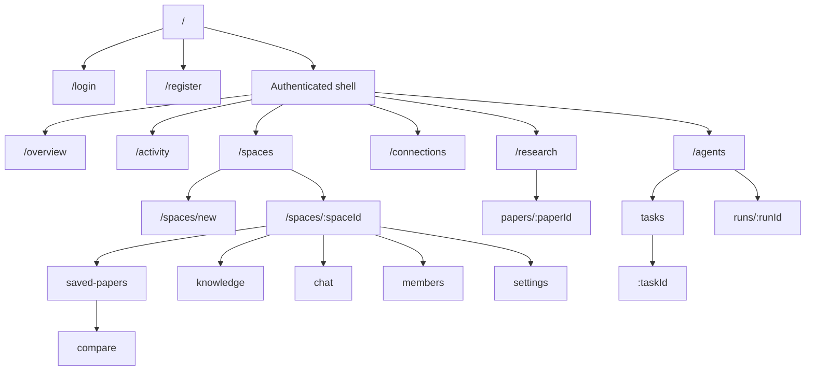
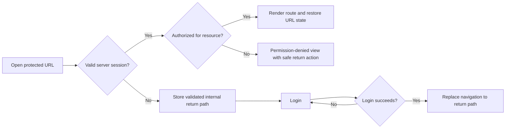

# ResearchWeave Navigation and Route Specification

## Purpose and status

This document records the **implemented Phase 10 route surface** and separately identifies unimplemented navigation concepts. The implemented tables are descriptive of the current router; future references do not imply that a route or feature exists.

The route model follows the approved product boundary: Research Space is the collaboration scope; Paper Detail and Execution Trace are detail routes; Chat, Saved Papers, Knowledge, and Members operate in a selected Space; external Research metadata and imported Knowledge remain distinct.

## Navigation mental model

ResearchWeave has one stable primary navigation: the authenticated application sidebar. It answers “which product area am I in?” Contextual tabs answer “which view of this resource am I using?” Breadcrumbs answer “how did this resource inherit its context?” Detail routes are reached from content and never become permanent sidebar items.

### Implemented Phase 10 navigation

```text
ResearchWeave
├─ Discover
│  └─ Research
└─ Workspace
   ├─ Overview
   ├─ Activity
   ├─ Spaces
   ├─ Agents
   └─ Connections

Selected Research Space
├─ Overview
├─ Saved Papers
├─ Knowledge
├─ Chat
├─ Members
└─ Settings                     (owner only)
```

Research is global discovery. Overview and Activity are global authenticated destinations backed by authorization-aware durable read models. Saved Papers and Knowledge are Space-scoped so that authorization and collaboration context remain explicit. Paper Detail is reached from Research results, and Paper Comparison is reached from a selected Space's Saved Papers; neither is a permanent sidebar destination.

### Unimplemented navigation reference

```text
Potential future additions
├─ Global Knowledge
└─ User Settings
```

These destinations are not present in the current router or sidebar. They remain design references only and must not appear until their real route and behavior exist.

The following are deliberately not primary navigation items:

- Space Chat, Members, and Space Settings: tabs inside a Research Space.
- Ask Knowledge and Knowledge Base Detail: contextual/detail routes.
- Paper Detail and Paper Comparison: result/detail workflows.
- Agent Task Detail and Execution Trace: detail workflows.
- Logout: an account action inside the user menu.
- Search, notifications, command menu, presence, and workspace switcher: absent until a real cross-product behavior exists.

### Secondary and contextual navigation

| Context | Navigation |
|---|---|
| Research Space | `Overview`, `Saved Papers`, `Knowledge`, `Chat`, `Members`, and owner-only `Settings` tabs. The space name and role remain above the tabs. |
| Knowledge | `Documents`, `Knowledge Bases` section tabs. `Ask` is an action/detail route tied to one knowledge base. |
| Research | Global Research provides search and Paper Detail. Saved Papers remain inside a selected Space; comparison starts from that Space's Saved Papers and opens `/spaces/:spaceId/saved-papers/compare`. |
| Agents | `Agents`, `Tasks`; Agent Detail and Run Trace are reached from records. |
| Settings | `Profile`, `Preferences` only when both are real; no provider/API-key page. |

Tabs use URL routes when a view should survive refresh or be shareable. Local tabs are reserved for presentational subdivisions that do not change the data boundary.

## Implemented route map — Phase 10

### Entry and public routes

| Route | Access | Purpose |
|---|---|---|
| `/` | Public resolver | Authenticated users redirect to `/overview`; unauthenticated users redirect to `/login`. |
| `/login` | Anonymous-only | Sign in and restore a validated internal return path, defaulting to `/overview`. |
| `/register` | Anonymous-only | Create an account, then open `/overview`. |

### Authenticated routes

| Route | Navigation role | Purpose |
|---|---|---|
| `/overview` | Primary | Bounded recent Spaces, active work, and recent Activity from the authenticated Overview read model. |
| `/activity` | Primary | Authorized unified Activity with URL-backed category and Space filters and backend cursor pagination. |
| `/research` | Primary | Real arXiv paper search with URL-backed query, page, and sort state. |
| `/research/papers/:paperId` | Detail | Persisted paper metadata, abstract evidence, source links, summary, and explicit Save-to-Space workflow. |
| `/agents` | Primary | System-managed Agent definitions, purpose, approved tools, limits, and runtime availability. |
| `/agents/tasks` | Secondary | Explicitly Space-scoped durable Task ledger and New Task entry. |
| `/agents/tasks/:taskId` | Detail | Immutable Task prompt and ordered durable Run attempts. |
| `/agents/runs/:runId` | Detail | Durable Run state, safe ordered steps, final answer, and server-validated evidence. |
| `/spaces` | Primary | Authorized Research Space list. |
| `/spaces/new` | Workflow | Create a Research Space. |
| `/spaces/:spaceId` | Space default | Space overview and truthful continuation actions derived from current resources. |
| `/spaces/:spaceId/saved-papers` | Space tab | Membership-authorized Saved Papers for this Space. |
| `/spaces/:spaceId/saved-papers/compare` | Space workflow | Compare two to four current-Space Saved Papers using stored metadata and abstracts; repeated `paper` parameters preserve selection, not results. |
| `/spaces/:spaceId/knowledge` | Space tab | Document upload, indexing state, retrieval, and grounded questions for this Space. |
| `/spaces/:spaceId/chat` | Space tab | Durable chat with authenticated realtime deltas. |
| `/spaces/:spaceId/members` | Space tab | Current membership and admission/removal workflows. |
| `/spaces/:spaceId/settings` | Owner-only Space tab | Rename and lifecycle controls. |
| `/connections` | Primary | Connection requests and accepted connections. |

Any route not listed above is absent from the current router. Global Knowledge, Knowledge Bases, standalone document detail, Agent definition detail, and user Settings remain unimplemented. Agent state refreshes through durable REST polling; no Agent-specific WebSocket route or protocol exists.

## Implemented route hierarchy



Potential global Knowledge, Knowledge Base, standalone document detail, Agent definition detail, and user Settings routes remain future design work. They are not part of the implemented hierarchy above.

## Authentication and route guards



Guard rules:

- Authentication truth comes only from the server session, never localStorage.
- The return path must be same-origin, begin with `/`, exclude auth routes, and be length-bounded before storage or navigation.
- Use replace navigation after login/logout redirects so Back does not create a redirect loop.
- Authorization failure is distinct from not found only when revealing resource existence is safe. Otherwise use the server's safe not-found response.
- Session expiry during a mutation shows a session-expired state, preserves safe unsent local input, and resumes only after re-authentication.
- Route loaders/query boundaries display request IDs from the standard error envelope when available.

## URL state

Put shareable, reload-safe view state in query parameters:

| State | Suggested parameter | Rule |
|---|---|---|
| Search text | `q` | Trimmed and length-bounded; never include secrets or document contents. |
| Space filter | `space` | Stable ID; `all` may be represented by absence. |
| Status filter | `status` | Allowlisted enum; repeated values only when the UI supports multi-select. |
| Sort | `sort` | Allowlisted field/direction token, not raw SQL-like text. |
| Research comparison | repeated `paper` | Validate count and IDs; canonicalize order only if comparison semantics are order-independent. |
| Tab | route segment | Use segments for primary sibling views, not `?tab=`. |

Cursor tokens may appear in the URL only if the server defines them as safe, bounded, and opaque. Otherwise preserve pagination in query cache/history state. Do not put prompts, chat drafts, access tokens, API keys, citation excerpts, or provider payloads in URLs.

Back/forward navigation must restore filters, selected tab, and scroll position when practical. Changing filters should usually replace the current history entry while explicit navigation and item selection should push.

## Breadcrumb rules

- Do not show a breadcrumb on `/overview`, primary lists, Login, or Register.
- Use breadcrumbs at resource depth two or greater, for example `Research Spaces / Atlas Study / Members`.
- Use resolved resource names, not raw IDs, after data loads. Skeleton the label to avoid layout shift.
- Every ancestor except the current page is a link.
- On mobile, show Back plus current parent; collapse middle ancestry into an accessible menu if necessary.
- Breadcrumbs never duplicate tabs or the entire sidebar.

## Page-header rules

| Route type | Header content |
|---|---|
| Primary list | Page title, one-sentence purpose when useful, one create/import/run action if implemented. |
| Detail | Breadcrumb, resource title, truthful status/evidence scope, contextual actions. |
| Space | Space title, role/context, then Space tabs. |
| Workflow/form | Back/breadcrumb, task title, consequences or scope, submit/cancel actions. |
| Dense data | Title and actions in flow; filter toolbar may be sticky below it. |

Headers do not contain decorative metrics, universal search, fake online state, or disabled future actions.

## Responsive navigation

- Desktop `>= 1200px`: expanded `248px` sidebar.
- Compact desktop `1024–1199px`: persistent `72px` rail with labels available to keyboard, pointer, and assistive technology.
- Tablet `< 1024px`: sidebar becomes a drawer; a `56px` top app bar contains menu trigger, concise current-area label, and at most one essential page action.
- Mobile `< 768px`: same drawer, full labels, `44px` rows, safe-area padding. Do not introduce a bottom navigation that competes with the desktop model or truncates the eight destinations.
- Opening/closing the drawer restores focus to the trigger. Route selection closes the drawer and moves focus to page content.

## Context preservation

- Space-scoped links carry or derive the active space. Switching tabs never loses the space ID.
- Returning from a detail route should restore the list's filter, sort, query, and approximate scroll position.
- `Save to space`, `Import to knowledge`, and `Run in scope` actions require the user to choose a space when context is ambiguous. Never silently choose the last space for a consequential mutation.
- When access to the current space is revoked, leave the resource route, clear its cached protected data, explain the change, and navigate to `/spaces`.
- Realtime reconnect restores subscriptions from the canonical route/context and then refreshes durable REST data.

## Navigation states

| State | Behavior |
|---|---|
| Route loading | Shell remains stable; main region shows route skeleton and `aria-busy`. |
| Route error | Route-level error view preserves shell and offers retry/return. Unexpected errors include request ID. |
| Not found | Clear 404 with return to the closest safe primary list. No technical stack information. |
| Permission denied | Clear access message and safe return; no partial protected content remains visible. |
| Destination not implemented | Do not render or link the navigation item. Documentation is not a reason to show a disabled placeholder. |
| Destination temporarily unavailable | Keep it visible only if the capability exists and explain the recoverable outage in its content boundary. |

## Naming conventions

- Routes use lowercase plural resource nouns and hyphens only when necessary.
- UI labels use `Research Spaces`, `Knowledge Bases`, `Saved Papers`, `Agent Tasks`, and `Execution Trace`.
- Use ResearchWeave domain language; do not introduce unrelated server, game, or terminal terms such as server IP, room password, hotbar, player, Redstone, or command teleport.
- Use `Chat` only within a Research Space. Use `Activity` for durable events and `Execution Trace` for agent operational steps.
- Use `Settings` for profile and harmless preferences; provider configuration remains server-only.

## Implementation gate

A route may be added to the router and navigation only when:

1. its screen and applicable states are ready to implement;
2. its API/authorization boundary exists or the work item explicitly includes it;
3. it has a real destination rather than a placeholder;
4. deep-link refresh and back behavior are defined;
5. mobile drawer/breadcrumb behavior is defined;
6. it does not disclose inaccessible resource existence or sensitive URL state.
